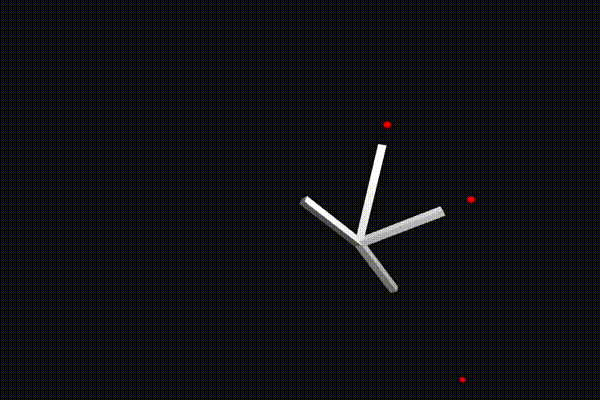
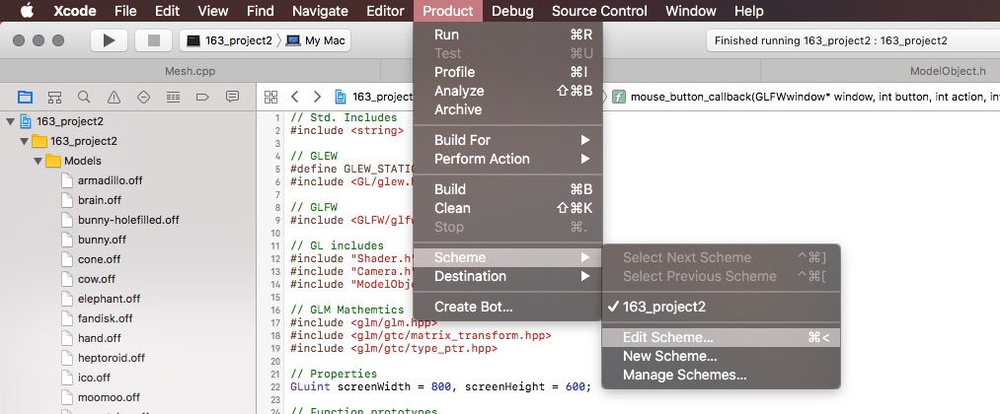
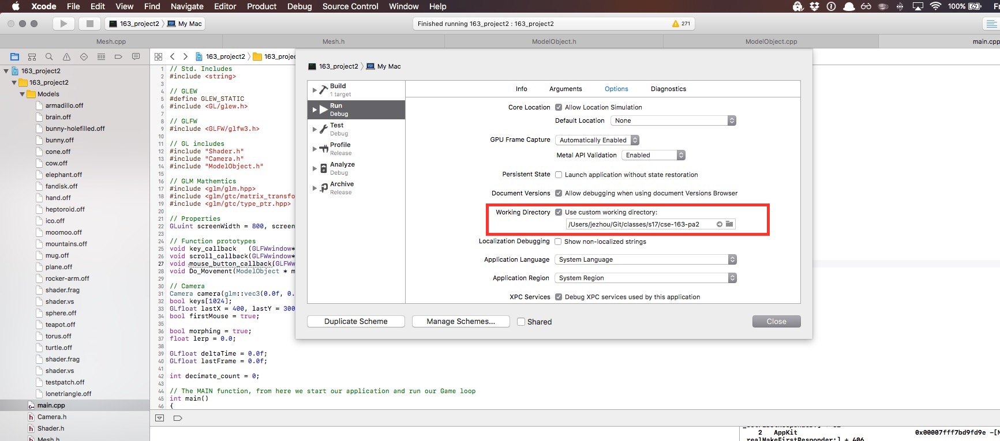

# cse-163-pa2 - Inverse Kinematics

Forward and Backward Reaching Inverse Kinematic (FABRIK) solver. Based on [FABRIK: A fast, iterative solver for the Inverse Kinematics problem](https://www.researchgate.net/publication/220632147_FABRIK_A_fast_iterative_solver_for_the_Inverse_Kinematics_problem);

Please read through the whole README before attempting to run the project.

# Project setup in Xcode.

Make sure to have the following libraries installed at /usr/local/lib

1. GLFW
2. GLEW
3. ASSIMP

Install through homebrew:

1. brew install glfw
2. brew install glew
3. brew install assimp

Leap Motion libraries and include files are already inside the repo. If this for some reason causes any problems, please feel free to go to the project properties and remove any references to the Leap SDK. If you have any other trouble, please do not hesitate to contact us ASAP.

# Important Note!

Just like in the last project, the shader files are local to the project, but since the project is compiled through xcode, you need to make sure your *working directory* is correctly set before you run the project, or else the project won't run.

You can do this by editing the default scheme. Screenshot below:

Check using custom working directory, and copy paste the absolute path to the project folder in the text box **(use <path-to-parent>/ikopengl instead of cse-163-pa2, the picture is from the last project)**.

# Types of Chains included

We have included 3 types of chains: a single chain with no constraints, a multichain with no constraints, and a single chain with constraints.

You can choose which one you want to interact with when you start up the program.

# Interacting with a chain

`arrow keys` : Translate the red target

`shift key + arrow keys` : Translate the target forward and backward

You may also connect a Leap Motion if you have the software installed; use your right index finger to move the target around.

# Questions?

Contact rcornwal or jezhou if you have any questions.
